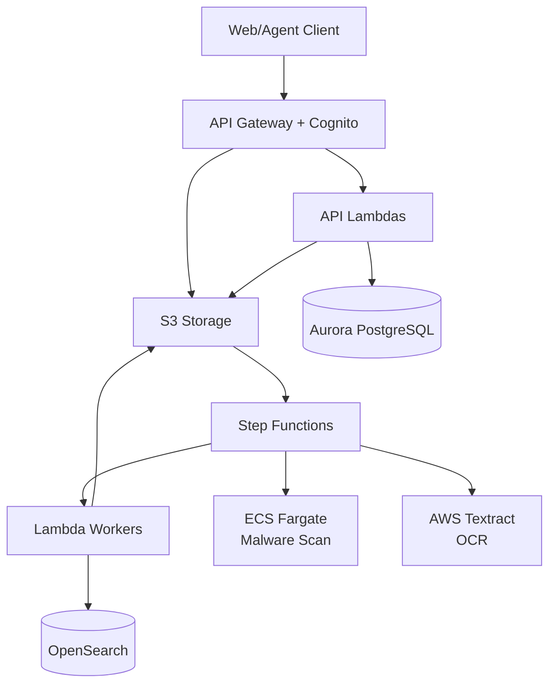
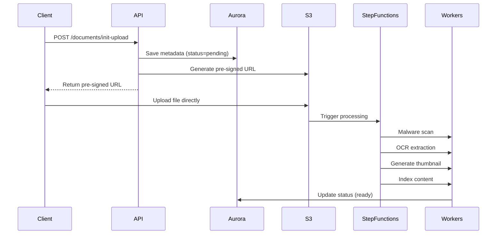
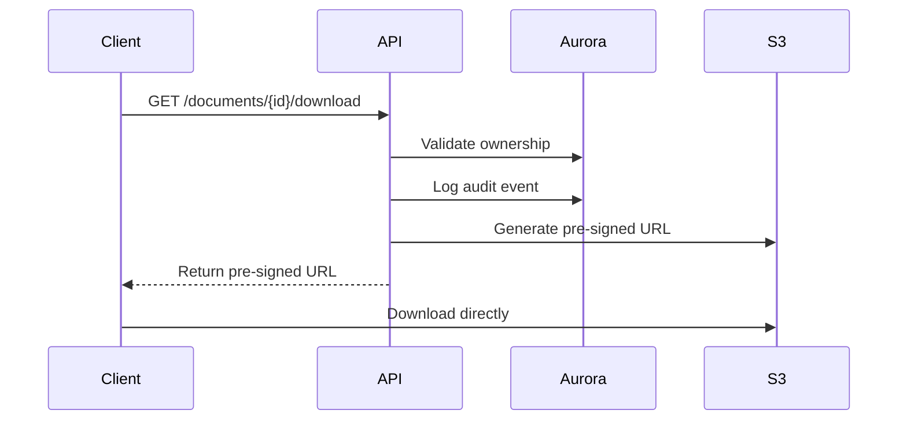
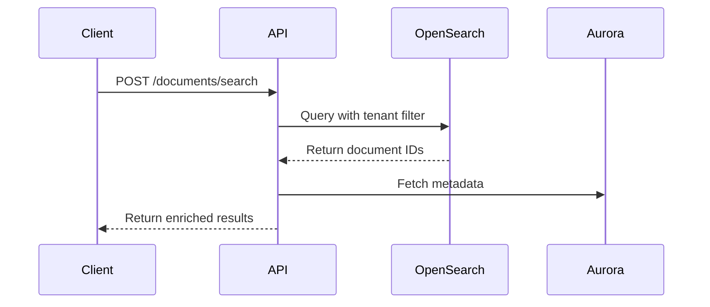
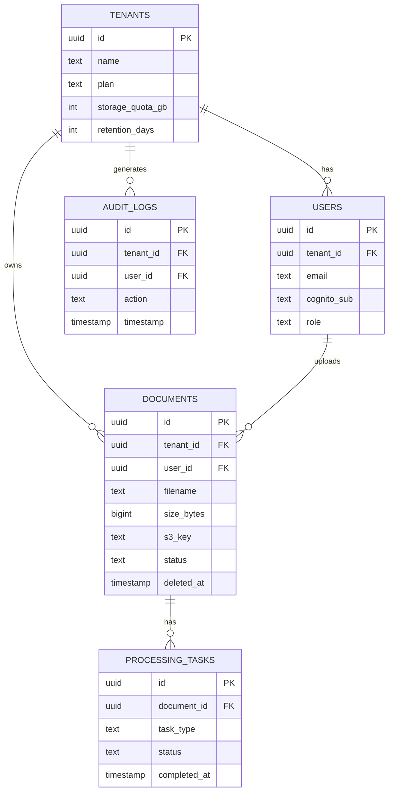
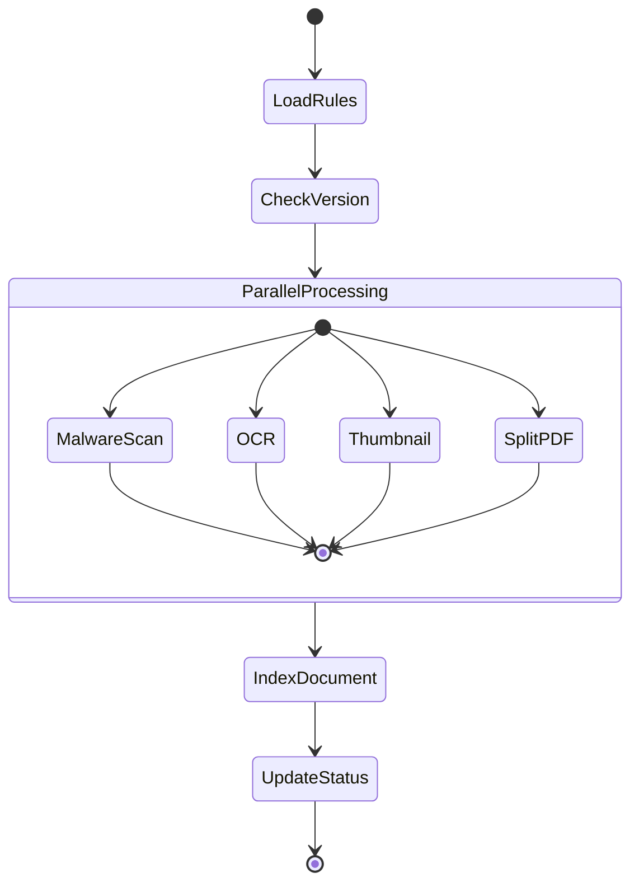
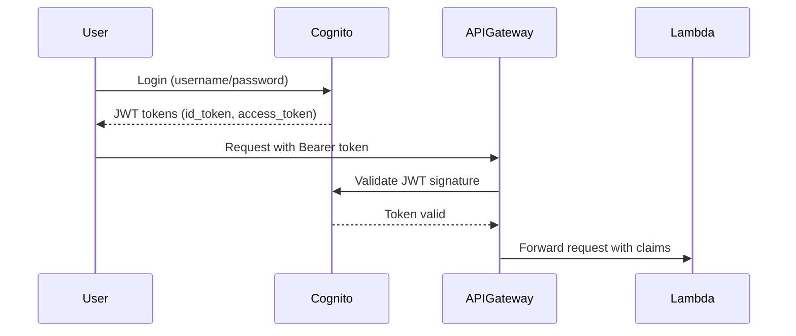
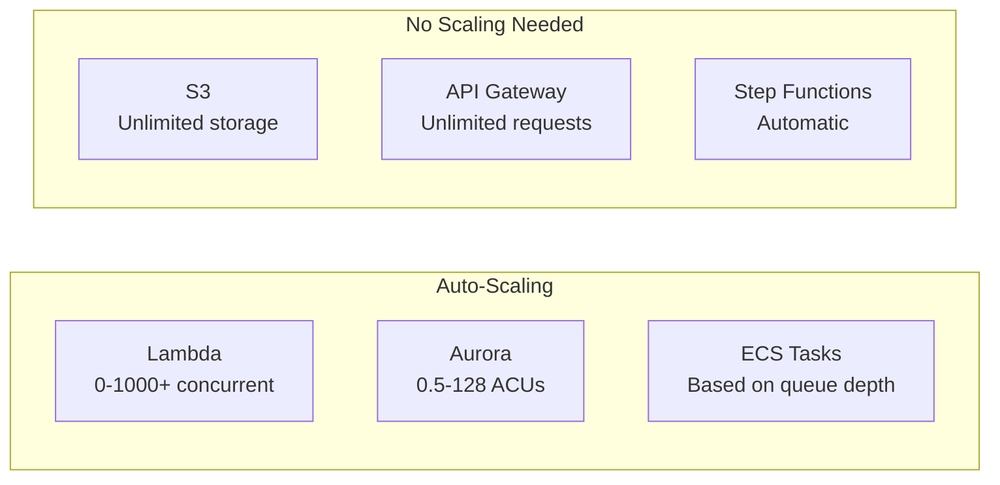
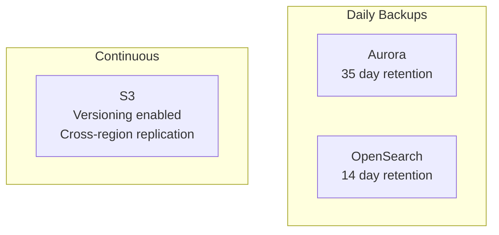

# System Design

Multi-tenant document management system built on AWS with secure upload, automated processing, and full-text search.

## Architecture



## Components

**API Layer**
- API Gateway: REST endpoints, JWT validation
- Lambda: Business logic, authorization
- Cognito: User authentication, token issuance

**Storage Layer**
- S3: Document storage with versioning
- Aurora Serverless v2: Metadata, tenant data
- OpenSearch: Full-text search index
- DynamoDB: Concurrency tracking

**Processing Layer**
- Step Functions: Workflow orchestration
- Lambda: Thumbnails, PDF split, indexing
- ECS Fargate: Malware scanning (ClamAV)
- Textract: OCR extraction

**Security**
- KMS: Encryption keys
- VPC: Network isolation
- IAM: Least privilege roles
- RLS: Tenant isolation in database

## Data Flows

### Upload Flow



### Download Flow



### Search Flow



## Database Schema



## S3 Structure

```
dms-documents-{env}/
├── {tenant-id}/
│   ├── documents/{document-id}/
│   │   ├── original/{version-id}
│   │   ├── thumbnails/{page}.jpg
│   │   └── split/{page}.pdf
│   └── temp/{upload-id}/
```

**Lifecycle**
- Incomplete uploads deleted after 7 days
- Deleted documents moved to Glacier after 30 days
- Permanent deletion after retention period

## Processing Pipeline



**Error Handling**
- Retry with exponential backoff (3 attempts)
- Failed tasks move to Dead Letter Queue
- CloudWatch alarms trigger on DLQ messages

## Security

### Authentication Flow



**JWT Scopes**
- `dms/upload`: Upload documents
- `dms/read`: Read/download documents
- `dms/delete`: Delete documents
- `dms/admin`: Administrative operations

### Encryption

**At Rest**
- S3: SSE-KMS with customer managed key
- Aurora: KMS encryption enabled
- OpenSearch: Encryption at rest
- Backups: Encrypted

**In Transit**
- TLS 1.2+ for all connections
- Pre-signed URLs with HTTPS only

### Tenant Isolation

**Row-Level Security**
```sql
CREATE POLICY tenant_isolation ON documents
    USING (tenant_id = current_setting('app.current_tenant_id')::uuid);
```

**OpenSearch**
- Separate index per tenant: `documents-{tenant-id}`
- Prevents cross-tenant queries

## Scalability



**Concurrency Control**
- DynamoDB tracks active uploads per tenant
- Quota enforcement at upload time
- Prevents single tenant resource exhaustion

## Performance Targets

| Operation | Target Latency |
|-----------|----------------|
| Init upload | < 200ms |
| List documents | < 300ms |
| Search | < 500ms |
| Download URL | < 100ms |
| Malware scan | < 30s |
| OCR per page | < 60s |
| Thumbnail | < 5s |

## Monitoring

### Key Metrics

**API**
- Request count by endpoint
- Error rate (4xx, 5xx)
- Latency (p50, p95, p99)

**Processing**
- Documents in processing
- Success/failure rate
- Queue depth
- DLQ message count

**Infrastructure**
- Lambda concurrent executions
- Aurora CPU/memory
- OpenSearch cluster health
- Storage usage

### Alarms

**Critical** (PagerDuty)
- API error rate > 5%
- DLQ messages > 0
- Database connection failures
- OpenSearch cluster red

**Warning** (Slack)
- API latency p95 > 1s
- Processing time > 2x baseline
- Storage quota > 80%

## Disaster Recovery

### Backups



**Recovery Objectives**
- RTO: 4 hours
- RPO: 24 hours

### Failure Scenarios

**Aurora Failure**
- Automatic failover to read replica (< 60s)
- No data loss (synchronous replication)

**S3 Failure**
- Automatic replication across 3 AZs
- 99.999999999% durability

**Region Failure**
- Manual failover to DR region
- Restore from snapshots

## Technology Choices

| Component | Choice | Why |
|-----------|--------|-----|
| Compute | Lambda | Pay per request, auto-scales, event-driven |
| Database | Aurora Serverless v2 | Auto-scaling, PostgreSQL, RLS support |
| Storage | S3 | Unlimited scale, versioning, lifecycle |
| Search | OpenSearch | Full-text search, managed service |
| Orchestration | Step Functions | Visual workflows, error handling |
| Malware | ECS + ClamAV | CPU-intensive, long-running |
| OCR | Textract | Managed, accurate, multi-language |

## Future Enhancements

- Document version history
- Real-time collaboration
- Mobile SDK
- Multi-region active-active
- Advanced threat detection
- Custom metadata schemas
